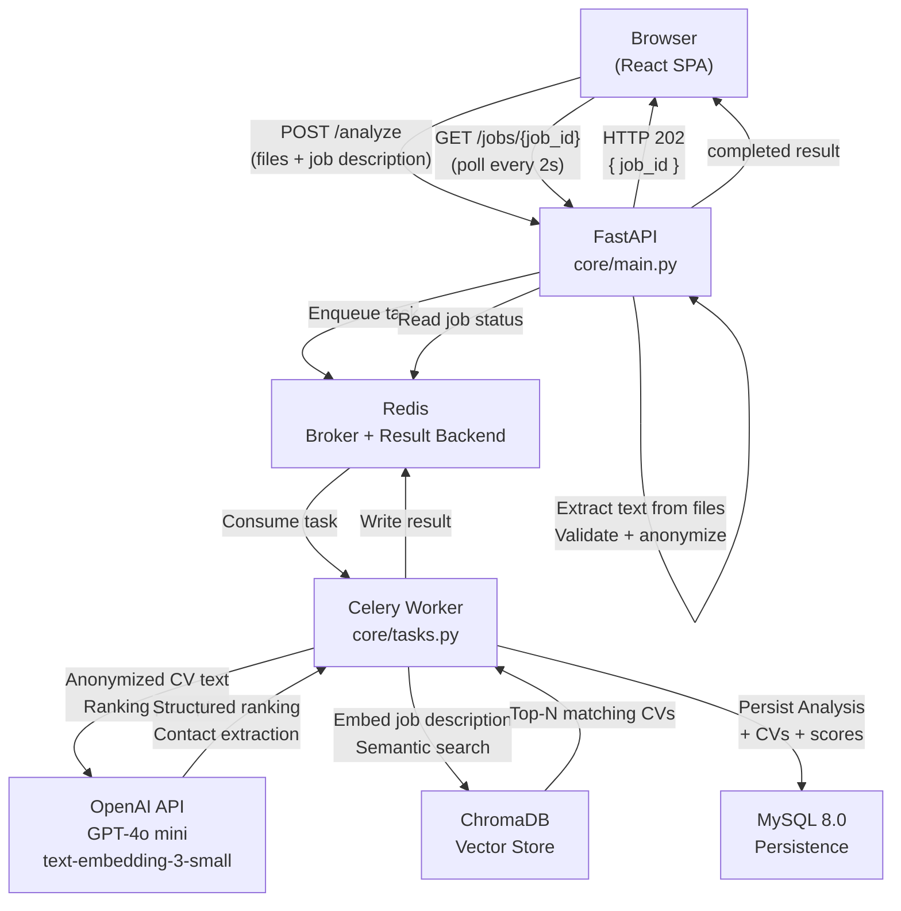
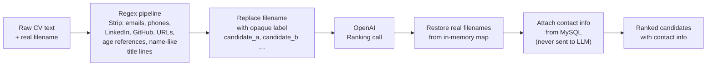
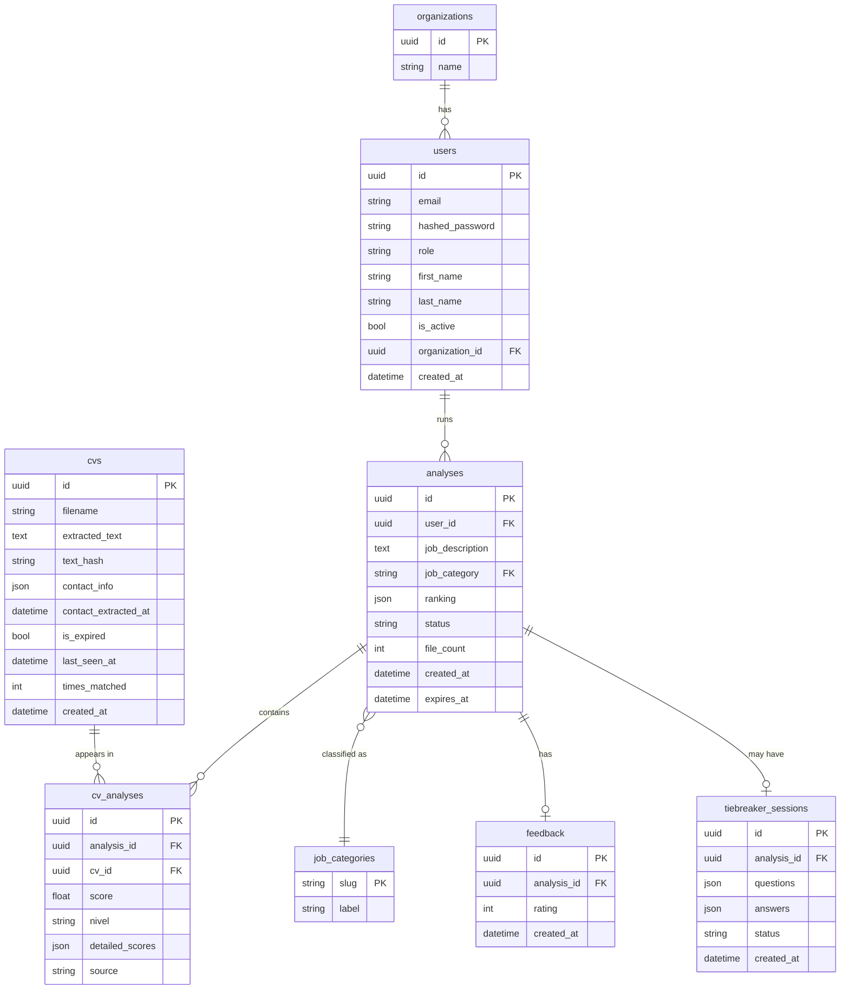
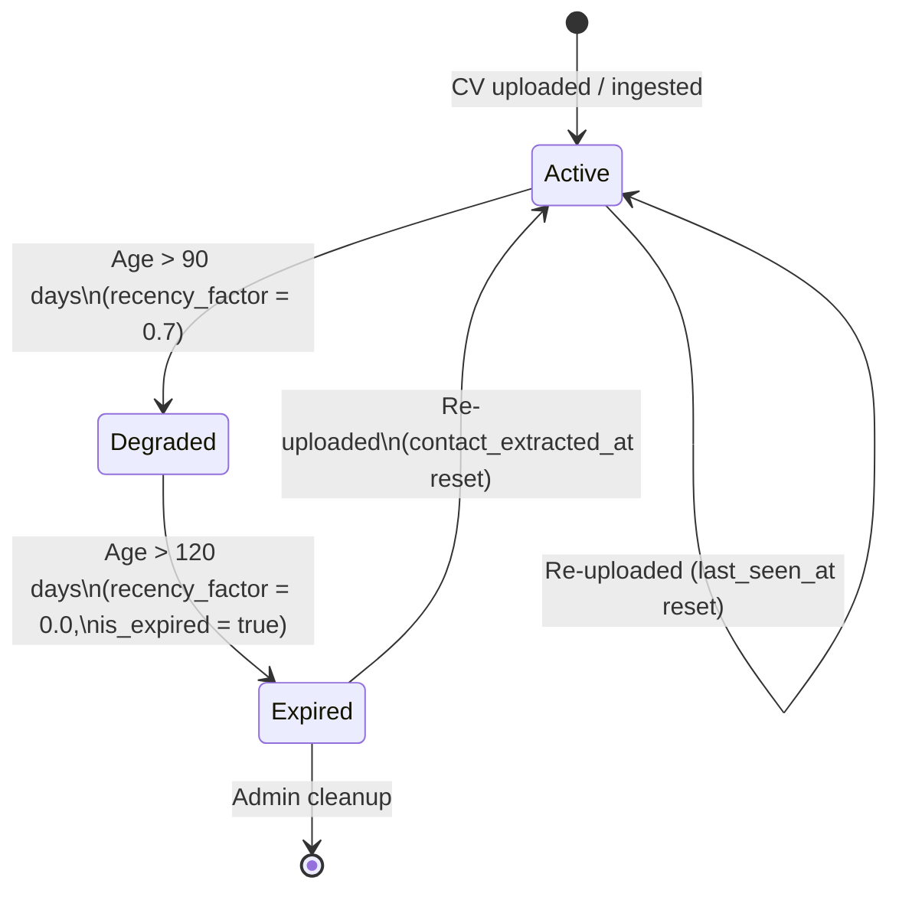

# Architecture

## Request Flow

The sequence below covers the `/analyze` endpoint. The `/match-job` flow is identical except step 4 performs a ChromaDB vector search instead of processing uploaded files.

---

## Anonymization Pipeline

Anonymization is a mandatory step that runs before every LLM call. It is not configurable.

---

## Database Schema

---

## CV Bank Lifecycle

---

## Key Design Decisions

| Decision | Rationale |
|---|---|
| Scores in `cv_analyses`, not on `cvs` | The same CV can score differently across different job descriptions; a junction table captures context-dependent results |
| Anonymization before every LLM call | Regex-based PII stripping is deterministic, zero additional API cost, and prevents the model from weighting demographic signals |
| CV TTL + recency factor | Hard deletion would lose candidate data; soft expiry with score degradation surfaces fresh candidates first while preserving history |
| Celery `--pool=solo` on Windows | Windows does not support the `prefork` multiprocessing start method that Celery uses by default on Linux/macOS |
| Refresh token in httpOnly cookie | Keeps the long-lived token out of JavaScript; access tokens are stored only in memory (not localStorage) to limit XSS exposure |
| Text extracted before enqueueing | Binary file data stays in the web process; the task queue only carries plain text, keeping message sizes small and parsing errors synchronous |
